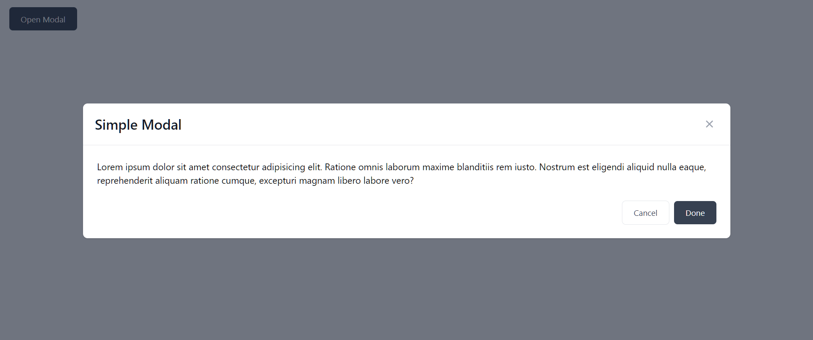

# React Wrapper for tailwind modal

Use Tailwind in React js, Compitable with react js and next js.

## Installation Commands

```bash
npm install react-tailwind-kit
```

### How to use

1. import css in index.js/ts or app.jsx or app.tsx. (if tailwind project import it after main tailwind css)

```ts
import 'react-tailwind-kit/dist/style.css';
```
2. use the simple modal

```tsx
import { Modal,Button } from 'react-tailwind-kit';

const App=()=>{
  const [show, setShow] = useState(false)

  return <div>
    <Button title='Open Modal' onClick={() => setShow(true)} type="fill" />

    <Modal
      title='Simple Modal'
      show={show}
      setShow={setShow}
      footer={<>
        <Button title='Cancel' onClick={() => setShow(false)} />
        <Button title='Done' onClick={() => setShow(false)} type="fill" />
      </>}
      onClose={() => { console.log("closing the modal") }} //optional
    >
      <p>Lorem ipsum dolor sit amet consectetur adipisicing elit. Ratione omnis laborum maxime blanditiis rem iusto. Nostrum est eligendi aliquid nulla eaque, reprehenderit aliquam ratione cumque, excepturi magnam libero labore vero?</p>
    </Modal>
  </div>
}

```

> screenshot 1



3. use offcanvas

```tsx
import { OffCanvas , Button } from 'react-tailwind-kit';

const App=()=>{
  const [show, setShow] = useState(false)

  return <div>
    <Button title='Open Left Off Canvas' onClick={() => setShow(true)} type="fill" />
    <Button title='Open Right Off Canvas' onClick={() => setShow(true)} type="fill" />

    <OffCanvas
      title='Left Modal'
      show={show}
      setShow={setShow}
      onClose={() => { console.log("closing the OffCanvas") }} //optional
    >
      <p>Lorem ipsum dolor sit amet consectetur adipisicing elit. Ratione omnis laborum maxime blanditiis rem iusto. Nostrum est eligendi aliquid nulla eaque, reprehenderit aliquam ratione cumque, excepturi magnam libero labore vero?</p>
    </OffCanvas>

    <OffCanvas
      title='Right Modal'
      position='right'
      show={show}
      setShow={setShow}
    >
      <p>Lorem ipsum dolor sit amet consectetur adipisicing elit. Ratione omnis laborum maxime blanditiis rem iusto. Nostrum est eligendi aliquid nulla eaque, reprehenderit aliquam ratione cumque, excepturi magnam libero labore vero?</p>
    </OffCanvas>
  </div>
}

```

> screenshot 2


